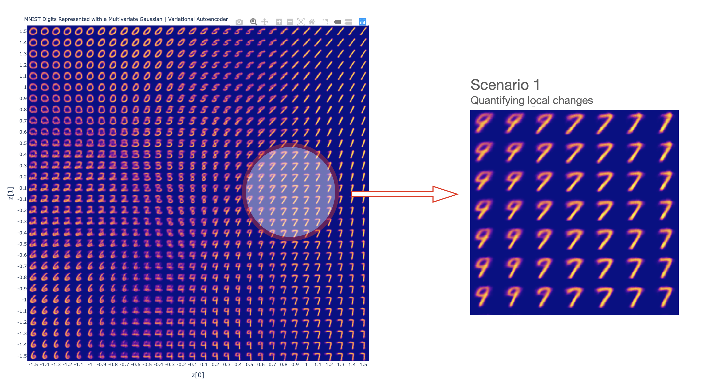
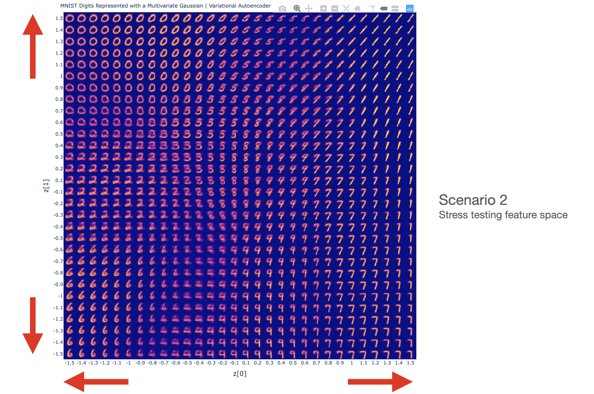

# generative_modelling_with_multivariate_gaussians

This repo intends to walkthrough a use case for sequence to sequence with attention, specifically for translating English to French. Using attention with this use case can be of a real benefit as the context/meaning of the sentence as a whole can be emphasised rather than simply translating a mapping from each english word to each french word. 

#### Interactive versions of the static plots can be found on the GitHub Page below 

[Entry point to GitHub Page](https://tobycassidy.github.io/generative_modelling_with_multivariate_gaussians/)

### Why it is useful? (explaining NN, or in general explaining features)
### local changes summed up -> global conclusions 
### Stress testing 
### Add on comments (Other techniques, e.g. GANS)

---
## Model Architecture / High Level Concept
---
# 
# 

---
## Usage
---
### 1. Data 
The data used for this analysis is sourced from Anki: [Tab-delimited Bilingual Sentence Pairs ](http://www.manythings.org/anki/). The sentence pairs of specific interest for the English to French use case can be found in the fra-eng.zip and are stored in this repo under data for convenience.

### 2. Environment
Please prepare an environment with python==3.8.0, and then use the command "pip install -r requirements.txt" for the dependencies. Note these dependencies in the requirements.txt are not as lean as they could be as this environment is set up to work for multiple tobycassidy repos. 

### 3. Run
Once the environment has been configured, simply go through the "walkthrough.ipynb" notebook at your own pace. The cell outputs have been committed to this repo so the walkthrough notebook does not need to be ran and environments do not need to be configured for convenience.  
